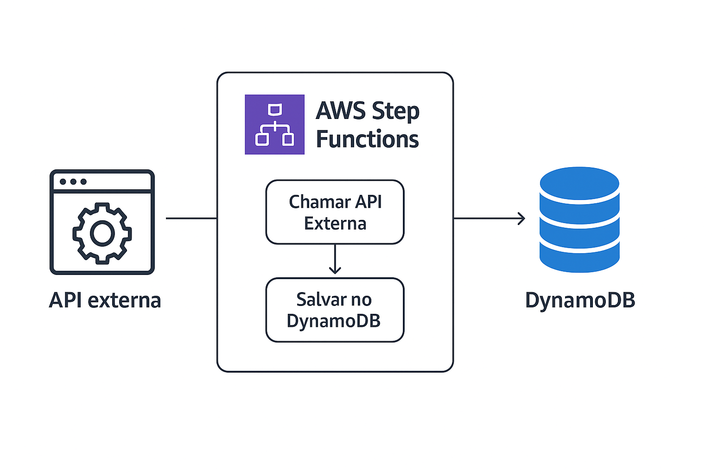

# AWS Step Functions

## Visão Geral
O **AWS Step Functions** é um serviço totalmente gerenciado que permite orquestrar e automatizar fluxos de trabalho compostos por múltiplas etapas, integrando diversos serviços da AWS e aplicações externas. Ele utiliza um modelo baseado em máquinas de estado (state machines), no qual cada etapa representa uma tarefa lógica, como execução de uma função, tomada de decisão, processamento paralelo ou chamada de API.

Essa abordagem facilita o controle de processos complexos, reduz o acoplamento entre sistemas e oferece alta visibilidade e rastreabilidade, uma vez que cada execução pode ser monitorada em tempo real pelo console da AWS.

O Step Functions é amplamente utilizado em pipelines de dados, orquestração de microsserviços, automação de tarefas operacionais e integração com sistemas de terceiros.

## Principais Benefícios

* Orquestração visual: O console oferece uma interface gráfica para acompanhar a execução do fluxo, facilitando o monitoramento e o diagnóstico.

* Integração Nativa com AWS: Compatível com mais de 200 serviços, incluindo Lambda, ECS, SQS, DynamoDB, SageMaker e SNS.

* Tolerância a Falhas: Oferece estratégias automáticas de retry, catch e fallback para lidar com erros em tempo de execução.

* Escalabilidade Automática: Cada execução é gerenciada de forma independente, garantindo performance mesmo em fluxos de alta demanda.

* Compatibilidade com APIs Externas: Suporta tarefas HTTP, permitindo chamadas a endpoints externos de forma segura.


## Arquitetura e Componentes

| **Componente**     | **Descrição**                                                                 |
|---------------------|------------------------------------------------------------------------------|
| **State Machine**   | Define o fluxo completo de execução e a sequência de estados.               |
| **State (Estado)**  | Representa uma etapa do fluxo (por exemplo, uma tarefa ou decisão).         |
| **Task**            | Executa ações específicas, como invocar funções Lambda ou realizar chamadas HTTP. |
| **Choice**          | Implementa lógica condicional dentro do fluxo.                              |
| **Parallel / Map**  | Executa tarefas simultaneamente ou itera sobre coleções de dados.            |
| **Execution**       | Instância de execução da máquina de estados, monitorada individualmente.     |

## Casos de Uso Comuns
| **Caso de Uso**                     | **Descrição**                                                                 |
|------------------------------------|------------------------------------------------------------------------------|
| **Pipelines de processamento de dados** | Coordenação de etapas de ingestão, transformação e armazenamento.           |
| **Microsserviços orquestrados**        | Integração entre funções Lambda e APIs de backend.                          |
| **Automação de processos corporativos** | Aprovação de solicitações, workflows de negócios e notificações automáticas. |
| **Integração com APIs externas**       | Comunicação segura com serviços de terceiros, como gateways de pagamento, APIs REST ou sistemas internos. |


## Integração com API's Externas
 > O Step Functions permite integrar fluxos de trabalho com APIs externas por meio do tipo de tarefa HTTP Task, usando o recurso arn:aws:states:::http:invoke. Essa funcionalidade é ideal para cenários onde é necessário buscar dados de sistemas externos, acionar webhooks ou enviar informações a outros serviços.




## Exemplo Prático: Fluxo com API Externa e DynamoDB

### Objetivo
#### Criar um fluxo que:
1. Realize uma chamada HTTP para uma API externa.
2. Capture a resposta retornada.
3. Armazene o resultado em uma tabela DynamoDB.

### 1. Estrutura da Máquina de Estados

A definição abaixo utiliza a Amazon States Language (ASL), formato JSON nativo do Step Functions:

```
{
  "Comment": "Fluxo que consome uma API externa e armazena o resultado no DynamoDB",
  "StartAt": "Chamar API Externa",
  "States": {
    "Chamar API Externa": {
      "Type": "Task",
      "Resource": "arn:aws:states:::http:invoke",
      "Parameters": {
        "ApiEndpoint": "https://api.exemplo.com/dados",
        "Method": "GET",
        "Headers": {
          "Content-Type": "application/json"
        }
      },
      "ResultPath": "$.ApiResponse",
      "Next": "Salvar no DynamoDB"
    },
    "Salvar no DynamoDB": {
      "Type": "Task",
      "Resource": "arn:aws:states:::dynamodb:putItem",
      "Parameters": {
        "TableName": "TabelaResultados",
        "Item": {
          "Id": { "S.$": "$.ApiResponse.id" },
          "Nome": { "S.$": "$.ApiResponse.nome" },
          "Timestamp": { "S.$": "$$.Execution.StartTime" }
        }
      },
      "End": true
    }
  }
}

```

### Permissões necessárias:

Crie uma **IAM Role** com as seguintes permissões para o Step Functions:

>* states:StartExecution

>* dynamodb:PutItem

>* states:InvokeHTTPEndpoint

Essa role será vinculada à máquina de estados durante a criação.

### 3. Criação pelo Console AWS

1.  Acesse AWS Step Functions → **Create state machine**
2.  Selecione **Author with code snippets**
3.  Cole o JSON acima no editor
4.  Atribua a IAM Role criada anteriormente
5.  Clique em **Create state machine**

Para testar, clique em **Start execution** e envie um JSON de entrada, por exemplo:
```
{
  "requestId": "12345"
}
```
 

### 4. Monitoramento

Durante a execução, o console do Step Functions exibirá:

* Fluxo completo das etapas em formato visual
* Logs detalhados de entrada e saída
* Integração com Amazon CloudWatch para auditoria e métricas

##  Conclusão

O AWS Step Functions é uma ferramenta essencial para arquiteturas modernas que exigem coordenação confiável e visual entre serviços.

Com suporte nativo a chamadas HTTP externas, o serviço amplia o escopo de automação além do ecossistema AWS, permitindo a criação de fluxos de negócio robustos, escaláveis e auditáveis.

Essa abordagem elimina a complexidade de código voltado à orquestração e proporciona um ambiente seguro, observável e de fácil manutenção para integrações distribuídas.
